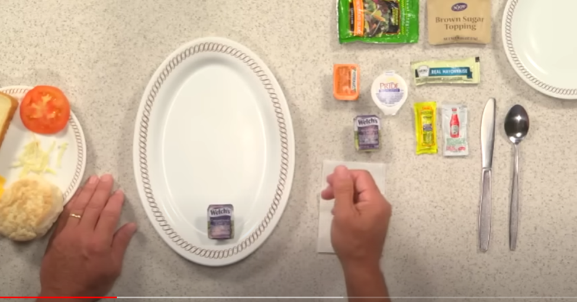
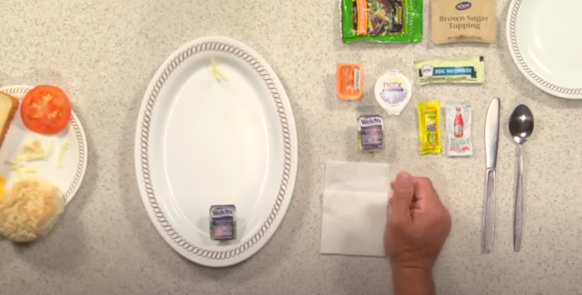

<h1>Waffle House Magic Marker Project</h1>

**NOTE: This Document may change given the project requirements**

Weather you are a student, traveling through the southern U.S., or need a late-night snack, one thing remains certain: Waffle House reliably delivers the correct order every time.

This is encompassed within the Waffle House **"Magic Marker System"**, which replaces traditional order-taking with positional markers on plates to convey meal requirements. 

Each placement of objects on the plate carries a specific meaning, ensuring the kitchen staff knows exactly what to prepare, versus manually reading through each individual order slip. 

For futher explenation, the YouTube video below illustrates how this system works. Start the Video at the 3:20 Mark.

YouTube Link: 

This project will explore the Magic Marker system using formal verification methods by modeling its rules and logic with State Machines. 

The tools that will be used in this project are:
- nuXmv
- Z3

<h2>Visual Example</h2>

The order below illustrates a basic order scrambled. This comes with:
- Two scrambled eggs
- White Toast
- Grits

In the event hashbrowns are added to replace grits, hashbrowns are placed on the top of the plate.

There are multiple combinations to mark specific orders. Of which will be modeled in this project. 

<h2> Objectives </h2>

1. **Model the Ordering System:**
- State Machines will represent order configurations.
2. **Development of Formal Specification:**
- Logic will be captured using LTL(Linear Temporal Logic) or CTL(Computation Tree Logic).
3. **Automated Verification:**
nuXmv or Z3 will be used to verify the following:
- Correctness: Ensuring the system produces the expected outcomes for all valid configurations.
- Conflict-Free Configuration: Ensure that the "marking" will prevent placement conflicts
- Compliance with Conditional Logic: Ensure that conditional rules are enforced.
- Termination: Verifying that orders move form start to completion without deadlocks or loops. 

